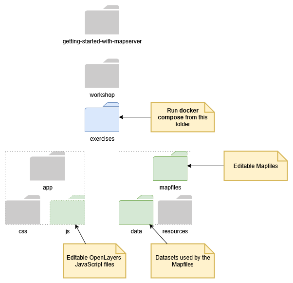

# Workshop Introduction

## Overview

This workshop is divided into the major topics listed below.

1. **Introduction**. An introduction to MapServer and the software used for the workshop. This
includes Docker, OpenLayers, and Apache.

2. The **Mapfile**. A Mapfile is MapServer's configuration file. It points
to the data the Map will display, it defines how the data will be displayed,
and how the data will be served to client applications such as an Internet
browser. This first set of exercises will help to get familiar with the structure,
keywords, and syntax of a Mapfile. 

3. MapServer **Inputs**. These exercises show what type of data can be used as inputs into
MapServer. Both vector data and raster data are covered. 

4. MapServer **Outputs**. These exercises show how MapServer can publish data. When first
created MapServer was used to produce map images, but now it can serve data out in
a large number of open geospatial formats. Focus is given to [OGC](https://www.ogc.org/standards/)
standards as these are free, open and interoperable.

5. **Advanced** topics. These are a collection of miscellaneous exercises that cover
a wide range of MapServer functionality. Selected exercises will be chosen based on the
needs to the workshop participants. MapServer has over 25 years of development and 
features so new topics will be added over time. 

## Workshop Outline

Below is a rough timeline for how the timings of the 4-hour workshop, with a 15 minute break.
These can be adapted based on the needs of the participants.

- 0h00 - 0h30 - Introduction to the workshop, Docker setup and tests
- 0h30 - 1h30 - Mapfile exercises
- 1h30 - 2h00 - Inputs
- Break (15 minutes)
- 2h15 - 3h00 - Outputs
- 3h00 - 3h15 - Brief Overview of Advanced topics
- 3h15 - 3h45 - Custom Mapfile creation
- 3h45 - 4h00 - Questions and conclusions

## Test the Docker Compose config

Before making any changes, we will make sure that the initial Docker Compose
setup provided to you is actually working. The configuration file for Docker Compose is found at the following location:

* `workshop/exercises/docker-compose.yml`

!!! question "Test the workshop configuration"

    1. In a terminal shell navigate to the workshop folder and type the following commands:

    ```bash
    cd workshop/exercises
    docker compose up
    ```

    2. Open <http://localhost:7000> in your browser, you should see an error message!
    3. Close by pressing `CTRL-C`

# Displaying your First Map

- Ensure that you have MapServer setup and running at <http://localhost:7000>.
- Now try opening the following MapServer URL in your browser - <http://localhost:7000/?map=/etc/mapserver/countries.map&mode=map>


!!! note

    You may also run the Docker container in the background (detached) as follows:

    ```bash
    docker compose up -d
    docker container ls  # verify that the mapserver container is running
    # visit http://localhost:7000 in your browser
    docker logs --follow mapserver  # view logs
    docker compose stop
    ```

## Folder Structure

Key folders are:

- `workshop/exercises/mapfiles` - the location of all the Mapfiles used in the workshop
- `workshop/exercises/mapfiles/data` - datasets used in the Mapfiles
- `workshop/exercises/app/js` - the JavaScript files used in the workshop



The full workshop folder structure is shown below:

```
--8<-- "tree.md"
```
