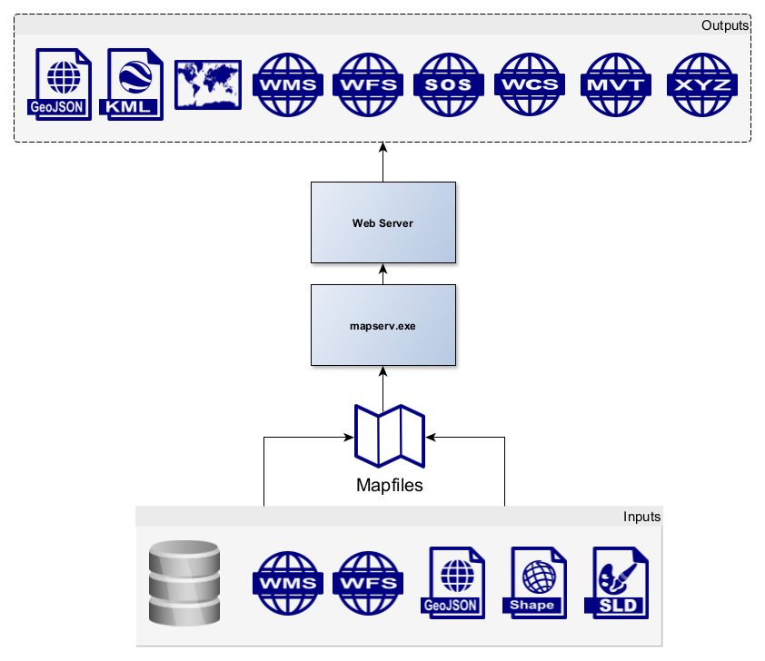
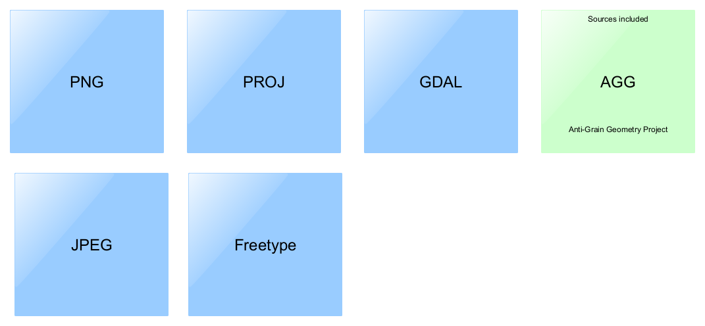

# MapServer

## Documentation

MapServer has comprehensive documentation that can be found online
at <https://mapserver.org/>. 

Key parts of the documentation are:

- [An Introduction to MapServer](https://mapserver.org/introduction.html)
- [Mapfile Directives](https://mapserver.org/mapfile/index.html)
- [Data Inputs](https://mapserver.org/input/index.html)
- [Data Outputs](https://mapserver.org/output/index.html)
- [OGC Support and Configuration](https://mapserver.org/ogc/index.html)
- [MapServer FAQ](https://mapserver.org/faq.html)

## How MapServer Works

In its most basic form, MapServer is a CGI program that sits inactive on your web server. When a request is sent to MapServer, it uses information from the request URL and the Mapfile to create an image of the requested map. 

## MapServer development

The first release of MapServer was in 1997, and is written in a combination of C and C++. 

A summary of MapServer development from [OpenHub](https://openhub.net/p/MapServer) is shown below:

## MapServer dependencies

MapServer is built on several image rendering and geospatial C/C++ libraries. 
The below image shows MapServer's key dependencies:

This means that improvements and features in libraries like GDAL also become available in MapServer. Any GDAL [raster driver](https://gdal.org/drivers/raster/index.html) or [vector driver](https://gdal.org/drivers/vector/index.html) can be used by MapServer. 

## Interacting with MapServer

Before services like WMS and WFS were added to MapServer, interaction was done using the custom keywords listed on the
[MapServer CGI Controls](https://mapserver.org/cgi/controls.html) page.These are still available for use in MapServer, but this workshop will focus on OGC services. For example we will use the [WMS](https://mapserver.org/ogc/wms_server.html) protocol to display the MapServer layer on top of an OSM background using OpenLayers.
