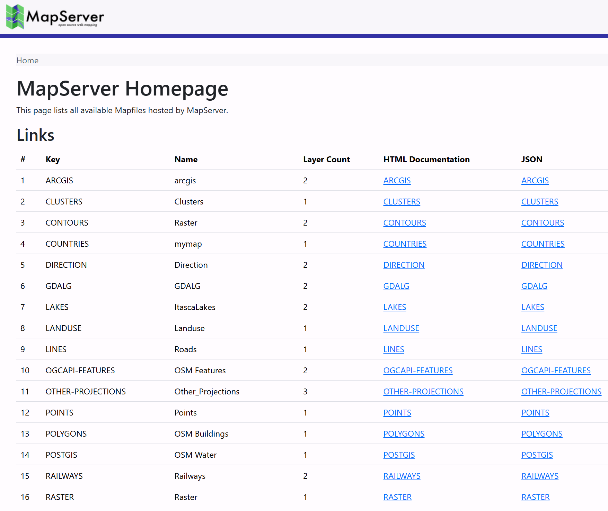

# MapServer Configuration File

MapServer 8.0 introduced support for a global [CONFIG](https://mapserver.org/mapfile/config.html) file.
This allows settings to be defined once and applied to all Mapfiles in a MapServer deployment,
reducing duplication and simplifying configuration.

This tutorial provides an introduction to the `CONFIG` file, and highlights the [Index Page](https://mapserver.org/output/index-page.html)
functionality that it enables.



## Overview

The configuration file used for the workshop can be found at `workshop/exercises/mapfiles/mapserver.conf`.
It uses a structure similar to a Mapfile, with configuration organized into blocks that are terminated with `END`.

```scala
CONFIG
    ENV
        ...
    END
    MAPS
        ...
    END
    PLUGINS
        # not currently used in the workshop, this block can be used
        # to add plugins for Oracle and Microsoft SQL Server drivers
        ...
    END
END
```

!!! important

    If you make changes in the `CONFIG` file you need to restart the web server.
    The configuration file is read only when the web server (Apache in this workshop) starts.
    The easiest way to do this in the workshop is to restart the `mapserver` container:

    ```bash
    docker restart mapserver
    ```

## `ENV` Settings

The `ENV` (Environment) block is used to store
[Environment Variables](https://mapserver.org/optimization/environment_variables.html) used by MapServer.
Placing them in the configuration file means they do not have to be duplicated in every Mapfile.
Settings defined in the configuration file can be overridden by settings in individual Mapfiles.
When both are present, the Mapfile value takes precedence.

In the workshop configuration file, the following variables are set:

- `MS_ONLINERESOURCE ""` the `ONLINERESOURCE` is used by various services, such as WMS, and WFS, to generate
  links, for example in `GetCapabilities` requests. An option to set this globally in the `CONFIG` file
  was added in MapServer 8.8 (see [RFC 141](https://mapserver.org/development/rfc/ms-rfc-141.html)) to avoid having to set
 `ows_onlineresource` for different servers (for example in development and production) in every Mapfile.
  In this workshop it is set to an empty string, allowing MapServer to automatically generate URLs based
  on the incoming request host and path.
- `OGCAPI_HTML_TEMPLATE_DIRECTORY "/usr/local/share/mapserver/ogcapi/templates/html-bootstrap/"`
  this setting points MapServer to the folder containing the Bootstrap HTML templates used when generating
  the OGC API interface, for example at <http://localhost:7000/timisoara/ogcapi/?f=html>.
- `MS_INDEX_TEMPLATE_DIRECTORY "/usr/local/share/mapserver/ogcapi/templates/html-index-bootstrap/"`
  a similar setting, but used to point to the Bootstrap templates used when generating the MapServer
  [Index Pages](https://mapserver.org/output/index-page.html).
- `MS_MAP_PATTERN "^/etc/mapserver/"` - This is a required setting used to restrict Mapfiles
  to specific filesystem locations. This prevents users from requesting arbitrary Mapfiles,
  reducing the risk of unauthorised data access. In the workshop Mapfiles are restricted
  to `/etc/mapserver` and subdirectories.

!!! tip

    There are several other settings commented out in the configuration file, to show the different
    environment variables available.

    These can be set globally in the `CONFIG` file, and then overridden in individual Mapfiles,
    using the syntax `CONFIG "VARIABLE_NAME" "VARIABLE_VALUE"`, for example `CONFIG  "MS_ERRORFILE" "stderr"`.

## `MAPS` Settings

The `MAPS` block contains a list of all Mapfiles available on the server, in the form of
`key "path"`:

```scala
MAPS
    # the paths used here, are the paths
    # within the MapServer Docker container
    CLUSTERS "/etc/mapserver/clusters.map"
    CONTOURS "/etc/mapserver/contours.map"
    # additional mapfiles...
END
```

The keys allow us to access the Mapfile using the URL in the form `http://server/KEY/`.

!!! note

    Mapfiles explicitly registered in the `MAPS` section are considered trusted and are not
    subject to `MS_MAP_PATTERN` validation because they are defined server-side rather than
    provided by client requests.

    `MS_MAP_PATTERN` is only applied when a Mapfile path is supplied by a client
    request, for example:

    `?map=/etc/mapserver/lines.map`

If we have set the `MS_INDEX_TEMPLATE_DIRECTORY` path in the `ENV` section above, then MapServer
will return an "Index Page", listing all these maps at the root of the MapServer URL: <http://localhost:7000/>.

Clicking on one of these links takes you to an individual Mapfile Landing Page, which lists the
services available for that Mapfile, such as WMS, WFS, WCS, and OGC APIs. For example <http://localhost:7000/timisoara/>.

## Code

!!! example

    - MapServer Index Page request: <http://localhost:7000/>
    - MapServer Mapfile Landing Page example: <http://localhost:7000/timisoara/>

??? Config file "mapserver.conf"

    ``` scala
    --8<-- "mapserver.conf"
    ```

??? Example Mapfile file "config.map"

    ``` scala
    --8<-- "config.map"
    ```

## Exercises

- Add the Mapfile `./workshop/exercises/mapfiles/config.map` to the configuration file
  `./workshop/exercises/mapfiles/mapserver.conf`. Check it appears in the MapServer Index page
  at <http://localhost:7000/>. You will need to restart the MapServer container to see this change.
- Enable the CGI functionality in the Mapfile by changing `"ms_enable_modes" "!*"`
  to `"*"` (or comment-out the whole line). This should create a new "OpenLayers Viewer"
  link at <http://localhost:7000/CONFIG_MAP/>.
- Comment and uncomment the various `enable_request` `METADATA` items, and see how they affect
  the available services for the Mapfile at <http://localhost:7000/CONFIG_MAP/>.

!!! tip

    When editing a Mapfile, changes are instantly reflected in the HTML Index Pages
    (when you refresh the browser). You only need to restart the MapServer Docker container
    if you edit the `mapserver.conf` file, as this is read once when the Apache web server
    starts.
