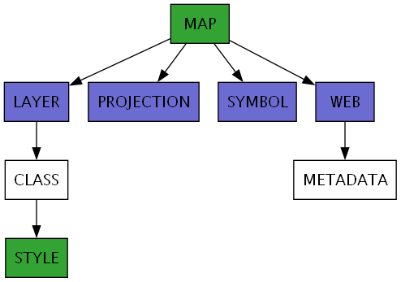

# A First Point Map

## Overview

Let's start with displaying the simplest spatial type - points.



There are several different [TYPE](https://mapserver.org/mapfile/symbol.html#mapfile-symbol-type)s of symbol available in MapServer.

The Mapfile symbolises the points using different [SYMBOLs](https://mapserver.org/mapfile/symbol.html). A symbol can point to an image file
on disk as in the example below:

```scala
SYMBOL
    NAME "city-hall"
    TYPE SVG
    IMAGE "data/icons/city-hall.svg"
END
```

It can also reference a character in a font file. References to different font files are added to a [FONTSET](https://mapserver.org/mapfile/fontset.html).
This file has an alias for the name of the font, and the path to the font file itself. This workshop uses the following `fontset.txt` file.

```
MaterialIcons          MaterialIcons-Regular.ttf
MaterialIconsRound     MaterialIconsRound-Regular.otf
LiberationMono         LiberationMono-Regular.ttf
LiberationSans         LiberationSans-Regular.ttf
```

In the Mapfile itself we can then reference this file and use any of the font aliases for symbols and labels. In the example below we're using a
cinema character from Google's [Material Symbols](https://fonts.google.com/icons).
We use HTML entity number of the symbol we want in the [CHARACTER](https://mapserver.org/mapfile/symbol.html#mapfile-symbol-character) keyword.
A list of these codes and their associated symbols can be seen at [http://localhost:5001/fonts.html](http://localhost:5001/fonts.html).

```scala
FONTSET "data/fonts/fontset.txt"
SYMBOL
    NAME "cinema"
    TYPE TRUETYPE
    FONT "MaterialIcons"
    CHARACTER "&#57388;"
END
```


## Code

!!! example

    - Direct MapServer request: <http://localhost:5000/?map=/etc/mapserver/points.map&mode=map&layer=pois>
    - Local OpenLayers example: <http://localhost:5001/points.html>

<div class="map">
  <iframe src="https://geographika.github.io/getting-started-with-mapserver-demo/points.html"></iframe>
</div>

??? JavaScript

    ``` js
    --8<-- "points.js"
    ```

??? Mapfile

    ``` scala hl_lines="5-10"
    --8<-- "points.map"
    ```

## Exercises


#### Possible Errors

If SVG symbols are not appearing, ensure they have a width and height set. You can view the contents of an SVG file in a text editor.

```xml
<svg xmlns="http://www.w3.org/2000/svg" width="10" height="10" viewBox="0 0 50 50">
    <path fill="currentColor" d="M7.743 21.8h3.485v22.4h5.229V25h5.229v19.2h5.228...
</svg>
```


