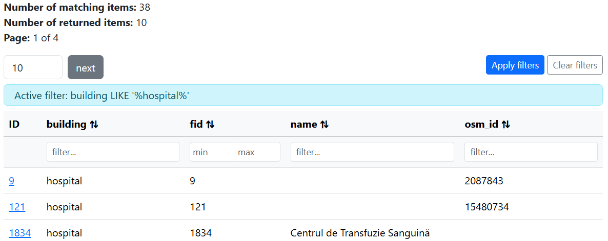

# OGCAPI Features Part 3 Filtering

Filtering allows requests to an OGC API - Features service to return only the features needed.
This can be based on feature properties, location, or a combination of both.
In this tutorial, you'll learn how filtering is supported in MapServer and how to use it in a sample web application.

<div class="map">
  <iframe src="https://mapserver.github.io/getting-started-with-mapserver-demo/timisoara.html"></iframe>
</div>

Let's take a look at the [Timișoara OGC API Landing Page](http://localhost:7000/TIMISOARA/ogcapi/?f=html). 
This contains a link to a page listing all the supported [Conformance Classes](http://localhost:7000/TIMISOARA/ogcapi/conformance?f=html).

The three we are interested in for this tutorial are:

- <http://www.opengis.net/spec/ogcapi-features-3/1.0/conf/queryables>
- <http://www.opengis.net/spec/ogcapi-features-3/1.0/conf/queryables-query-parameters>
- <http://www.opengis.net/spec/ogcapi-features-3/1.0/conf/filter>

!!! note

    As this is an unreleased feature (due as part of the MapServer 8.8 release), documentation can only be seen on the [documentation preview](https://mapserver.github.io/MapServer-documentation/ogc/ogc_api.html)
    web site.

We can see which attributes in the **buildings** layer are filterable by opening the queryables endpoint:

<http://localhost:7000/TIMISOARA/ogcapi/collections/buildings/queryables?f=html>

This list is controlled in MapServer by the `oga_queryable_items` keyword in the layer `METADATA` block. 
In this example we use the special value `all`, which exposes all layer attributes as queryables
(similar to `gml_include_items` when set to `all`). If we only want selected attributes we can
use a comma-separated list.

```scala
    LAYER
        NAME "buildings"
        TYPE POLYGON
        # allow the OGR FeatureId to be returned and used for querying
        # see https://github.com/MapServer/MapServer/pull/7533
        PROCESSING "OGR_EXPOSE_FID=TRUE"
        METADATA
            "ows_title" "Buildings"
            "gml_include_items" "all"
            "gml_featureid" "fid"
            "gml_types" "auto"
            "oga_queryable_items" "all"
            # or a list of properties
            # "oga_queryable_items" "name,osm_id"
        ...
```

The default MapServer Bootstrap templates then expose these queryables as simple filter inputs in the HTML interface. 
You can try this directly on the items page:

<http://localhost:7000/TIMISOARA/ogcapi/collections/buildings/items?f=html>



## Filter Types

CQL2 stands for Common Query Language 2, an OGC standard for defining filters on feature data.

CQL2-text and CQL2-JSON are two equivalent encodings of the same filtering language. CQL2-text is a
human-readable syntax. CQL2-JSON represents the same logic as a structured JSON object,
making it easier for software to generate, validate, and manipulate programmatically.

When you use the Bootstrap template above and apply a filter, you will see the query in the URL, for example:

<http://localhost:7000/TIMISOARA/ogcapi/collections/buildings/items?f=html&filter=building+LIKE+%27%25hospital%25%27&filter-lang=cql2-text>

The `filter-lang=cql2-text` parameter indicates that the filter is written in CQL2-text.
The filter itself is URL-encoded (for example spaces become `+` and special characters are percent-encoded),
which is required because it is being passed in a URL query string.

We can also write the same query using CQL2-JSON:

```json
{
  "op": "like",
  "args": [
    { "property": "building" },
    "%hospital%"
  ]
}
```

Both expressions mean the same thing: return features where the `building` attribute contains "hospital".

The JSON filter looks as follows as an encoded-URL:

<http://localhost:7000/TIMISOARA/ogcapi/collections/buildings/items?f=json&filter=%7B%22op%22%3A%22like%22%2C%22args%22%3A%5B%7B%22property%22%3A%22building%22%7D%2C%22%25hospital%25%22%5D%7D&filter-lang=cql2-json>

If you open this in a browser, you will see a list of matching features. These are returned in JSON because we supplied the `f=json` parameter.
We also have to add the `&filter-lang=cql2-json` parameter, as by default MapServer assumes `cql2-text`.

In addition to CQL2 filters, MapServer also supports simple query parameter filtering on queryable attributes.
For example, `&building=hospital` is a shorthand for an equality-style filter on the building attribute.
This is convenient for quick lookups but lacks the expressiveness of full CQL2.

<http://localhost:7000/TIMISOARA/ogcapi/collections/buildings/items?f=json&building=hospital>

## Custom Application with Filtering

MapServer's filtering support allows us to quickly build powerful applications, using
simple API calls. <http://localhost:7001/timisoara.html> links to a custom OpenLayers application,
using the OGC filtering API to filter buildings by type, and highlight them on a map.

The key parts of the code relating to filtering are building the filter string (as `cql2-text`):

```js
const cqlFilter = `building = '${buildingType}'`;
return `${baseUrl}/timisoara/ogcapi/collections/buildings/items?` +
    `filter=${encodeURIComponent(cqlFilter)}&filter-lang=cql2-text&limit=1000&f=json`;
```

And updating the data source when the selection changes:

```js
document.getElementById('building-select').addEventListener('change', (e) => {
    const newSource = new VectorSource({
        format: new GeoJSON(),
        url: buildOgcUrl(e.target.value),
        strategy: allStrategy,
    });
    vectorLayer.setSource(newSource);
});
```

The options for the drop-down list are defined in the `./workshop/exercises/app/timisoara.html` page.

```html
<select id="building-select">
    <option value="apartments">Apartments</option>
    <option value="church">Church</option>
    <option value="commercial">Commercial</option>
    <option value="hospital">Hospital</option>
    <option value="office">Office</option>
    <option selected value="university">University</option>
</select>
```

## Code

!!! example

    - MapServer OGC API Features request: <http://localhost:7000/timisoara/ogcapi/collections/buildings/items?f=html>
    - Local OpenLayers example: <http://localhost:7001/timisoara.html>

??? JavaScript "timisoara.js"

    ``` js
    --8<-- "timisoara.js"
    ```

??? Mapfile "ogcapi-features.map"

    ``` scala
    --8<-- "timisoara.map"
    ```

## Exercises

- Update the `oga_queryable_items` metadata keyword to only include the "building" and "name" fields.
  Check that the list of queryables is updated at:
  <http://localhost:7000/TIMISOARA/ogcapi/collections/buildings/queryables?f=html>,
  and also in the Bootstrap page:
  <http://localhost:7000/TIMISOARA/ogcapi/collections/buildings/items?f=html>.

- Add a new building type to the dropdown in `./workshop/exercises/app/timisoara.html`.
  You can find additional types by inspecting the
  [buildings items page](http://localhost:7000/TIMISOARA/ogcapi/collections/buildings/items?f=html).
